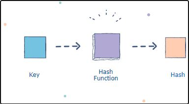
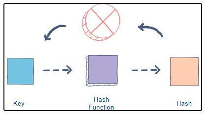
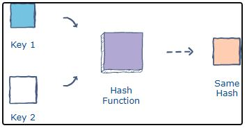

<h1 align="center">Hashing and Collison</h1>
### What is hashing?

Hashing is a process of converting a key into another value using hash function. Hash function is used to generate pr assign the new value to the key according to a mathematical order. The new value generated by the hash function is called as hash value or simply a hash.

A hashing function is a one-way algorithm l, we cannot convert hash back to the original key.

### What is Collisions?

Two keys can generate the same hash. This phenomenon is known as a <b>collision</b>. There are several ways to handle collisions.

### What is hash table ?

A hash table is a type of data structure that stores key-value pairs. The key is sent to a hash function that performs arithmetic operations on it. The result (commonly called the hash value or hash) is the index of the key-value pair in the hash table.

### Components of a hash table

<b>A basic hash table consists of two parts</b>:

<b>1. Hash function</b>

As we’ve already seen, the hash function determines the index of our key-value pair. Choosing an efficient hash function is a crucial part of creating a good hash table. You should always ensure that it’s a one-way function, i.e., the key cannot be retrieved from the hash. Another property of a good hash function is that it avoids producing the same hash for different keys.

<b>2. Array</b>

The array holds all the key-value entries in the table. The size of the array should be set according to the amount of data expected.

### Collisions in hash tables & resolutions
A collision occurs when two keys get mapped to the same index. There are several ways of handling collisions.

<b>1. Linear probing</b>

If a pair is hashed to a slot which is already occupied, it searches linearly for the next free slot in the table.

<b>2. Chaining</b>

The hash table will be an array of linked lists. All keys mapping to the same index will be stored as linked list nodes at that index.

<b>3. Resizing the hash table</b>

The size of the hash table can be increased in order to spread the hash entries further apart. A threshold value signifies the percentage of the hash table that needs to be occupied before resizing. A hash table with a threshold of 0.6 would resize when 60% of the space is occupied. As a convention, the size of the hashtable is doubled. This can be memory intensive.

 Contributed by <a href="https://github.com/ShyamKumar1">Shyam Kumar</a> With 💜. 

 Reach me on

  &nbsp;&nbsp;&nbsp;&nbsp;
  &nbsp;&nbsp;&nbsp;&nbsp;
  &nbsp;&nbsp;&nbsp;&nbsp;
  &nbsp;&nbsp;&nbsp;&nbsp;

