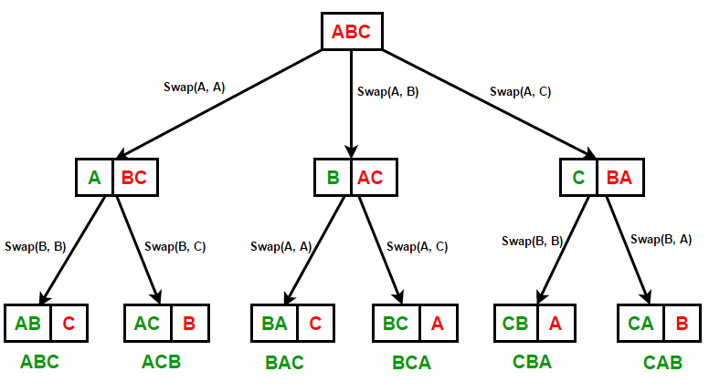

<h1>How to find Lexicographic Rank of a string?</h1>

For example, consider the below lexicographical permutations of the string "CBA" and find it's rank.



```
ABC ACB BAC BCA CAB CBA
Lexicographic rank of "CBA" is 6
```

<p>&nbsp;<br>
A simple solution would to use <tt><a href="https://www.techiedelight.com/std_next_permutation-overview-implementation/" target="_blank" rel="noopener noreferrer">std::next_permutation</a></tt> that generates the next greater lexicographic permutation of a string. The idea is to sort the string in ascending order and calculate repeatedly calculate lexicographic next permutation till current permutation becomes equal to the given string.</p>

``` c++
#include <iostream>
#include <string>
using namespace std;
 
// Function to find Lexicographic rank of a string using
// std::next_permutation
int findLexicographicRank(string key)
{
    string str = key;
    int rank = 1;        // rank starts from 1
 
    // sort the string in ascending order
    sort(str.begin(), str.end());
 
    while (1)
    {
        // if current permutation is equal to the key, return its rank
        if (key == str)
            return rank;
 
        // find next lexicographically ordered permutation
        if (!next_permutation(str.begin(), str.end()))
            break;
        rank++;
    }
}
 
// Find Lexicographic rank of a string
int main()
{
    string key = "CBA";
 
    cout << "Lexicographic Rank of " << key << " is "
        << findLexicographicRank(key);
 
    return 0;
}
```

> <b>Lexicographic rank of "CBA" is 6</b>


<hr>

### Contributed by <a href="https://github.com/ShyamKumar1">Shyam Kumar</a> With 💜. 

### Reach me on
<p align='center'>
  <a href="https://www.linkedin.com/in/shyam-kumar-9b9841157/"></a>&nbsp;&nbsp;&nbsp;&nbsp;
  <a href="https://www.instagram.com/_smiling_storm_/" target="_blank"></a>&nbsp;&nbsp;&nbsp;&nbsp;
  <a href="mailto:shyam.ceolife@gmail.com?subject=Olá%20Punit"></a>&nbsp;&nbsp;&nbsp;&nbsp;
  <a href="https://www.facebook.com/shyam.george15/" target="_blank"></a>&nbsp;&nbsp;&nbsp;&nbsp;
</p>
