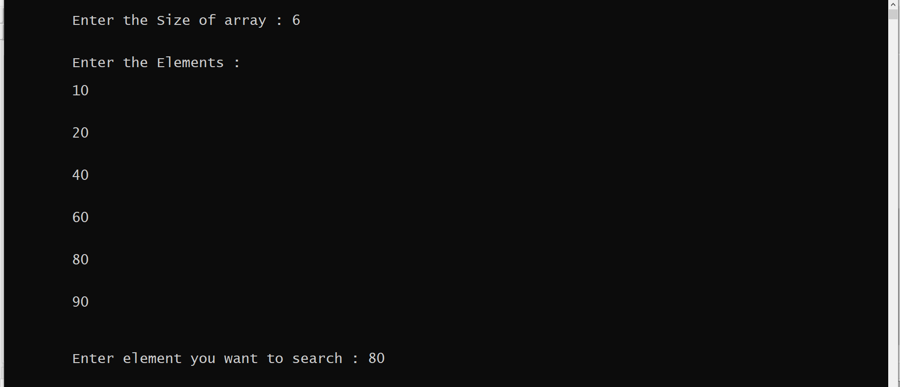
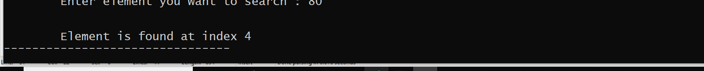

<h1 style="text-align:center;color:#DBD06F">Binary Search</h1>
<br/>

# What is Binary Search ??

Binary Search is a searching algorithm for finding an element's position in a sorted array.
This search algorithm works on the principle of divide and conquer.

In this approach, the element is always searched in the middle of a portion of an array.

Binary search looks for a particular item by comparing the middle most item of the collection. If a match occurs, then the index of item is returned. If the middle item is greater than the item, then the item is searched in the sub-array to the left of the middle item. Otherwise, the item is searched for in the sub-array to the right of the middle item. This process continues on the sub-array as well until the size of the subarray reduces to zero.

> **Binary search can be implemented only on a sorted list of items. If the elements are not sorted already, we need to sort them first.**

<br/><br/>

# Binary Search Working

Binary Search Algorithm can be implemented in two ways which are discussed below.

**1-Iterative Method**

**2-Recursive Method**

The general steps for both methods are discussed below.

1- The array in which searching is to be performed is:


Let  **x=4**  be the element to be searched.

2- Set two pointers low and high at the lowest and the highest positions respectively.


3- Find the middle element ```mid``` of the array ie. ```(arr[low + high]) / 2 = 6```.


4 - If x == mid, then return mid.Else, compare the element to be searched with m.

5- If ```x > mid```, compare ```x``` with the middle element of the elements on the right side of ```mid```. This is done by setting ```low``` to ```low = mid + 1```.

6 - Else, compare ```x``` with the middle element of the elements on the left side of ```mid```. This is done by setting ```high``` to ```high = mid - 1```.


7- Repeat steps 3 to 6 until low meets high.


8 - ```x=4``` is found 


### **One more Example:**

**Initial Array**


First, we shall determine half of the array by using this formula −

```
mid = low + (high - low) / 2
```
Here it is, 0 + (9 - 0 ) / 2 = 4 (integer value of 4.5). So, 4 is the mid of the array.


Now we compare the value stored at location 4, with the value being searched, i.e. 31. We find that the value at location 4 is 27, which is not a match. As the value is greater than 27 and we have a sorted array, so we also know that the target value must be in the upper portion of the array.


We change our low to mid + 1 and find the new mid value again.

```
low = mid + 1
mid = low + (high - low) / 2
```
Our new mid is 7 now. We compare the value stored at location 7 with our target value 31.


The value stored at location 7 is not a match, rather it is more than what we are looking for. So, the value must be in the lower part from this location.


Hence, we calculate the mid again. This time it is 5.


We compare the value stored at location 5 with our target value. We find that it is a match.

We conclude that the target value 31 is stored at location 5.

---

# Algorithm

**1.Iteration Method:**

```
do until the pointers low and high meet each other.
    mid = (low + high)/2
    if (x == arr[mid])
        return mid
    else if (x > A[mid]) // x is on the right side
        low = mid + 1
    else                       // x is on the left side
        high = mid - 1
```

**2. Recursive Method:**

```
binarySearch(arr, x, low, high)
    if low > high
        return False 
    else
        mid = (low + high) / 2 
        if x == arr[mid]
            return mid
        else if x < data[mid]        // x is on the right side
            return binarySearch(arr, x, mid + 1, high)
        else                               // x is on the right side
            return binarySearch(arr, x, low, mid - 1)
```
# Input



# Output


<br/>
<br/>

***
   ***
   ***

   **<h2 align="center"> Contributed by <a href="https://github.com/sudeepshukla930">Sudeep Shukla</a> With 💜. </h2>**

<br/>

  # Reach me on
<p align='center'>
  <a href="https://www.linkedin.com/in/sudeep-shukla-657384193/"></a>&nbsp;&nbsp;&nbsp;&nbsp;
  <a href="mailto:sudeepshukla930@gmail.com" target="_blank"></a>&nbsp;&nbsp;&nbsp;&nbsp;
  
  
</p>

****
****


