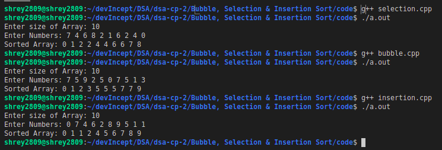

# Purpose

These codes are used sort an array  

# Method

## Buuble Sort

This is a very naive approach in which we repeatedly compare each element with its neighbour and if the previous element is bigger than the forward element (in case of ascending sorting), we swap the two elements and this approach is continued again and again.

```c++
for (int i = 0; i < n - 1; i++)
    for (int j = 0; j < n - i - 1; j++)
        if (arr[j] > arr[j + 1])
            swap(arr[j], arr[j + 1]);
```

## Insertion Sort

In this we maintain two parts in the array - the sorted part and the unsorted part. At each iteration step we pick the first element of the unsorted part and place at the right (appropriate) position in the sorted part. The elements in the sorted part which are bigger than the new element are moved forward by one position to make place for this new element.

```c++
for (int i = 1; i < n; i++)
{
    int temp = arr[i], j = i - 1;
    while (j >= 0 && arr[j] > temp)
    {
        arr[j + 1] = arr[j];
        j--;
    }
    arr[j + 1] = temp;
}
```

## Selection Sort

In this we maintain two parts in the array - the sorted part in the front and the unsorted part. In each iteration we find the smallest element in the unsorted part and it is added to the end of the sorted part by swapping the elements. So basically smallest elements are brought in the front one by one.
> This can alse be implemented in reverse in which we take the largest element to the back.

```c++
for (int i = 0; i < n - 1; i++)
{
    int mini = i;
    for (int j = i + 1; j < n; j++)
        if (arr[j] < arr[mini])
            mini = j;

    swap(arr[mini], arr[i]);
}
```
> All the above methods have time complexity O(n^2), hence they are very slow in the case of large array sizes and more optimal methids have been created which can sort the array in O(nlogn)

# Ouput


