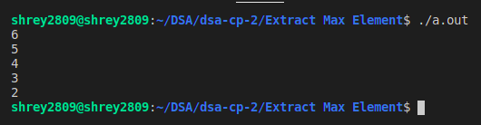

# Purpose

This code is used to extract max element from a max-heap and then recreate the heap.

# Method

The max element in a max-heap is the root of that heap (tree). The value of the root is stored in a var and then to simulate extraction of the root the heap size is reduced.

```c++
int extractMax()
{
    int max = arr[0]; // Take the largest value (root)
    arr[0] = arr[n - 1]; // Bring leaf node to root
    n--; // Descrease size of heap
    heap_down(0); // Heapify the tree by moving new root down
    return max;
}
```

Now, to heapify the resulting tree we bring the leaf node (last element) to the root. As that element was brought from the bottom of the tree it might be smaller than its children and hence that node must be pushed to down to its appropriate position by comparing and swapping with its childern nodes while larger value nodes are brought up. This is the method to send a node downwords.

```c++
void heap_down(int i)
{
    int l = 2 * i + 1, r = l + 1, maxi = i;

    // Check children of node. If child exists then compare value and find largest valued child.
    if (leaf(l)) // if child exit then left node must exist
        return;

    if (arr[l] > arr[i])
        maxi = l;

    if (!leaf(r) && arr[r] > arr[maxi])
        maxi = r;

    // If the children nodes have larger value then swap the children and parent node and continue further down.
    if (maxi != i)
    {
        swap(arr[i], arr[maxi]);
        heap_down(maxi);
    }
}
```

# Ouput


