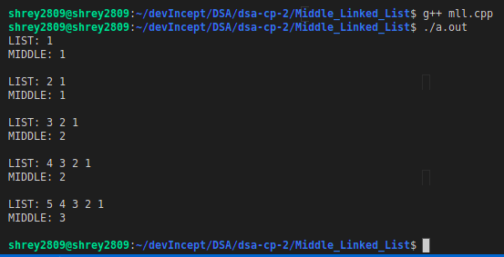

# Purpose

This code is used to middle element in a linked list. In case if two middle elements exist (length if list is even), the second middle element is returned.

# Method

In this I use two pointers. One pointer moves two steps at a time and one poniter moves one step at a time. So, when the fast pointer (which moves twice at once) reaches the end or the second last element then it stops going further and the node at which the slow pointer is at that time is the middle element of the linked list. This is because distance moved by slow pointer is half the distance moved by the fast pointer.

```c++
struct node *temp = head;
struct node *last = head;

if (head)
{
    while (last && last->next)
    {
        last = last->next->next;
        temp = temp->next;
    }
}

if (temp)
        printf("MIDDLE: %d\n\n", temp->data);
```

> A naive approach can also be used in which we calculate the length of the linked list by traversing it once and then again traverse the linked list by half of the length i.e., if for example the length is 5 we move forward by 2 on the second traversal and thus we get that the 3rd element is the middle most element.

# Ouput


