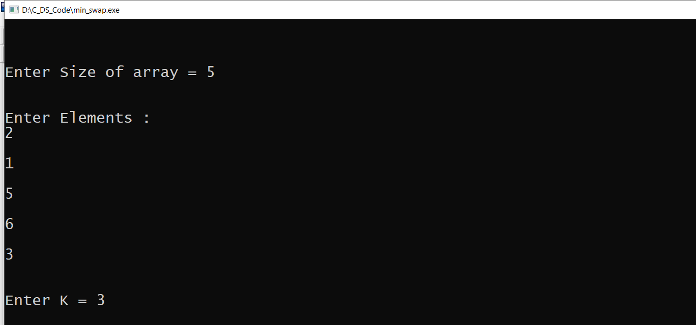
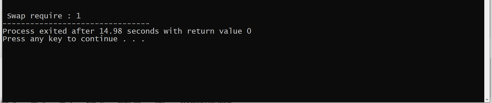

# What does this code do 🙇🏻  ?
### This is a program to find Minimum swaps required to bring all elements less than or equal to k together in array.
***
# <span style="color:grey"> Best Approch</span>
### The best approch to solve this problem by **Sliding Window Technique**
***
# Algorithm 💻
<ol>
 <li>Count all elements which are less than or equals to ‘k’. Let’s say the count is ‘cnt’</li>
 <br/>
 <li>Using two pointer technique for window of length ‘cnt’, each time keep track of how many elements in this range are greater than ‘k’. Let’s say the total count is ‘bad’.</li>
 <br/>
 <li>Repeat step 2, for every window of length ‘cnt’ and take minimum of count ‘bad’ among them. This will be the final answer.</li>
</ol>

***
# Code ✍
```C++
// C++ program to find minimum swaps required 
// to club all elements less than or equals 
// to k together 
#include <iostream> 
using namespace std; 

// Utility function to find minimum swaps 
// required to club all elements less than 
// or equals to k together 
int minSwap(int *arr, int n, int k) { 
	
	// Find count of elements which are 
	// less than equals to k 
	int count = 0; 
	for (int i = 0; i < n; ++i) 
		if (arr[i] <= k) 
			++count; 
	
	// Find unwanted elements in current 
	// window of size 'count' 
	int bad = 0; 
	for (int i = 0; i < count; ++i) 
		if (arr[i] > k) 
			++bad; 
	
	// Initialize answer with 'bad' value of 
	// current window 
	int ans = bad; 
	for (int i = 0, j = count; j < n; ++i, ++j) { 
		
		// Decrement count of previous window 
		if (arr[i] > k) 
			--bad; 
		
		// Increment count of current window 
		if (arr[j] > k) 
			++bad; 
		
		// Update ans if count of 'bad' 
		// is less in current window 
		ans = min(ans, bad); 
	} 
	return ans; 
} 

// Driver code 
int main() { 
	
	 int arr[100];
   int n;
   cout<< "\n\nEnter Size of array = " ;
   cin>> n;
   cout<< "Enter Elements : ";
   for(int i=0;i<n;i++){
	   cout<<"\n;
       cin>>arr[i];
   }
   int k;
   cout<< "\n\nEnter K = ";
   cin >> k;
   
	cout <<"\n\n Swap required : " << minSwap(arr, n, k); 
	return 0; 
} 
```
***
# Example :
```
The given array is:  
2  7  9  5  8  7  4  
```
## Pictorial Representation:


<br/>

## Initial FlowChart:


<br/>


<br/>

# Input


# output


<br/>

# Time Complexity ⌛
In the above solution we traverse the array once which gives us linear time complexity
```
Time complexity: O(n)
Auxiliary space: O(1)
```
 <br/>

## <h2 align="center"> Contributed by <a href="https://github.com/sudeepshukla930">Sudeep Shukla</a> With 💜. </h2>

<br/>

  # Reach me on
<p align='center'>
  <a href="https://www.linkedin.com/in/sudeep-shukla-657384193/"></a>&nbsp;&nbsp;&nbsp;&nbsp;
  <a href="mailto:sudeepshukla930@gmail.com" target="_blank"></a>&nbsp;&nbsp;&nbsp;&nbsp;
  
  
</p>

  

