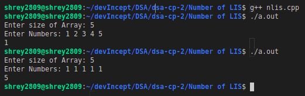

# Purpose

This code is used to find count of longest increasing subseuences in an array.

# Method

## Naive Approach

The most basic approach can be generate all possible subsequences present in the array and then count the longest increasing subsequences. This is a naive approach as has 2^n time complexity to find all the subsequences.

## Dynamic Programming

The approach used is similar to the problem of finding the longest increasing subsequence length. It is used to avoid overlapping subproblems. We create and update 2 arrays **_l_** and **_d_**. The array l handles the length of the longest increasing subsequence ending at the ith index. The array d maintains the count of the longest increasing subsequence at index i.

```c++
for (int i = 0; i < size; i++)
{
    for (int j = 0; j < i; j++)
    {
        if (arr[i] > arr[j] && l[j] + 1 > l[i])
            l[i] = l[j] + 1, d[i] = d[j];
        else if (arr[i] > arr[j] && l[j] + 1 == l[i])
            d[i] += d[j];
    }
}
```


Then, to find the length of the longest increaing subsequence we loop over the array l and find the maximum length.

```c++
for (int i = 0; i < size; i++)
    len_lis = max(l[i], len_lis);
```

Finally, for the answer we loop over the array d and if the length of that index **l[i]** is equal to maximimum length we increment our answer by **d[i]**.

```c++
for (int i = 0; i < size; i++)
    if (l[i] == len_lis)
        ans += d[i];
```
# Ouput

