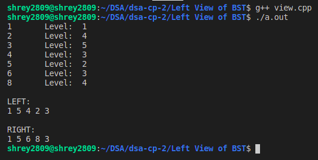

# Purpose

This code is used to view the left and right side of the BST.

# Method

In this we traverse down and push nodes into the queue level by level. To print the left view of the BST we take the first element of the queue for a given level and print its values and then pop all the other nodes of that level and also push the nodes left and right children into the queue. This process is repeated until the queue is emptied (i.e., all nodes have been visited).

```c++
void leftView(struct node *root)
{
    if (!root)
        return;

    queue<struct node *> nodes;
    nodes.push(root);

    while (nodes.size())
    {
        int len = nodes.size();
        for (int i = 0; i < len; i++)
        {
            struct node *temp = nodes.front();
            nodes.pop();

            if (!i)
                cout << temp->data << " ";

            if (temp->left)
                nodes.push(temp->left);
            if (temp->right)
                nodes.push(temp->right);
        }
    }
}
```

Similar approach is followed in the right view of the BST and the only difference is that the right child is pushed first into the queue and then the left child is pushed.

```c++
...(code)
// Just the order of the if statements is flipped.
if (temp->right)
    nodes.push(temp->right);
if (temp->left)
    nodes.push(temp->left);
```

# Ouput


